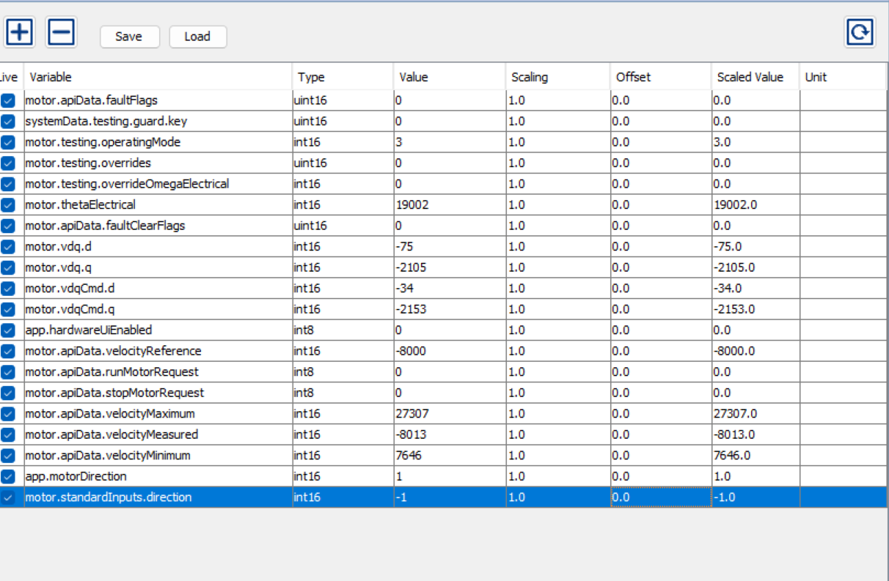
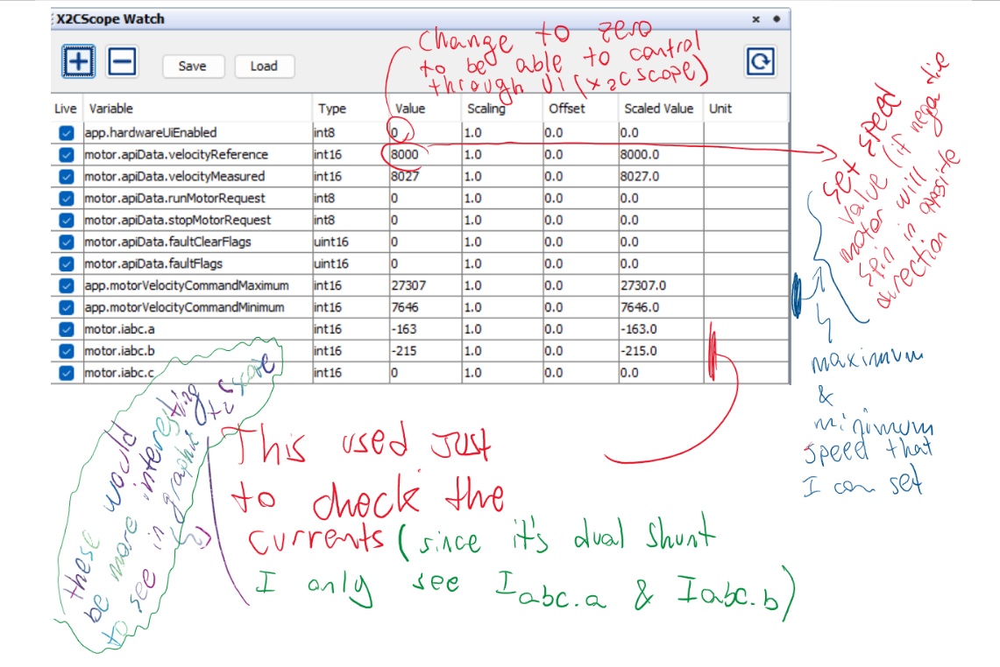

This document describes the workflow for creating Custom Board Support for MotorBench v2.5 in order to test and evaluate the Atmel Low Voltage BLDC Motor Control Starter Kit. It includes hardware setup, YAML creation, verification steps, X2C Scope integration, and related references.

.jpg)

----------------------------------------------------------------------
OVERVIEW
----------------------------------------------------------------------

This project covers:
- Setting up MotorBench 2.50 for custom board support
- Creating a custom YAML for the Atmel LV BLDC starter kit
- Checking current sensing, DC-link sensing, and PWM correctness
- Running forced-commutation tests before closed-loop
- Using X2C Scope for runtime control (no hardware buttons)
- Using MCAF Test Harness for evaluation
- Providing project files (CustomBoardTest1.X) and motor XML

----------------------------------------------------------------------
HARDWARE USED
----------------------------------------------------------------------

- [ATSAMD21BLDC24V-STK1 Atmel LV BLDC Starter Kit](https://ww1.microchip.com/downloads/aemDocuments/documents/OTH/ProductDocuments/UserGuides/Atmel-42681-SMART-ARM-based-Motor-Control-Kit_UserGuide.pdf)

- [dsPIC33CK64MC105 Curiosity Nano](https://www.microchip.com/en-us/development-tool/ev88g73a)

- SCT013-050 current transformer (50A → 1V output)  

- Breadboard and jumper wires  

- PC with MPLAB X and MotorBench v2.5 beta  
  MPLAB X IDE: https://www.microchip.com/en-us/tools-resources/develop/mplab-x-ide  
 [motorBench](https://www.microchip.com/en-us/solutions/technologies/motor-control-and-drive/motorbench-development-suite)
The system reads two phase currents (up to approx. 8.25 A) and the DC-link voltage (up to approx. 50 V).

----------------------------------------------------------------------
REQUIRED DOCUMENTATION
----------------------------------------------------------------------

Read before starting:

1. [X2Cscope – Real-time variable visualization  ](https://x2cscope.github.io/)

2. [MCAF – Motor Control Application Framework](https://microchiptech.github.io/mcaf-doc/8.0.1/)

----------------------------------------------------------------------
CREATING THE CUSTOM BOARD YAML
----------------------------------------------------------------------

The YAML was created in VS Code using the StarterBoard example from MotorBench.

Notes:
- Indentation must use spaces (no tabs).
- Reference examples can be obtained by exporting the YAMLs for MCLV-2, MCLV-48V, or MCHV boards.
- The completed file is: Atmel-LVBLDC.yaml

ATPLL estimator was chosen due to better startup behavior.  
Startup velocity was increased from the default.

----------------------------------------------------------------------
X2C SCOPE CONTROL (NO HARDWARE UI)
----------------------------------------------------------------------

Because no buttons or potentiometers are used, all runtime interaction is done through X2C Scope.

Important MCAF variables:

hardwareUIenabled = 0  
runMotorRequest = start motor  
stopMotorRequest = stop motor  
VelocityReference = desired speed (negative value reverses direction)

Notes:
- motorDirection and direction variables are not used.
- Direction is controlled only by the sign of VelocityReference.

----------------------------------------------------------------------
USING THE TEST HARNESS
----------------------------------------------------------------------

Enable by editing "options.h":

#define MCAF_TEST_HARNESS

This activates the MCAF test harness for controlled testing.

A clear video tutorial on how to use the MCAF Test Harness is available here:  

----------------------------------------------------------------------
PRE–CLOSED-LOOP VERIFICATION
----------------------------------------------------------------------

Before enabling closed-loop control, these steps were completed:

1. Voltage mode and forced commutation (see Board Definition Notes).
2. Verify PWM polarity and timing.
3. Verify phase current scaling using SCT013-050.
4. Verify DC-link voltage scaling.
5. After all readings matched expectations, closed loop was tested.

Closed-loop FOC worked without extensive tuning.

----------------------------------------------------------------------
PROJECT FILES
----------------------------------------------------------------------

Atmel-LVBLDC.yaml  
./Atmel-LVBLDC.yaml

Motor parameters (AtmelBLDC-motor.xml):  
./AtmelBLDC-motor.xml

MPLAB X Project (CustomBoardTest1.X):  
(not uploaded but directory expected)

----------------------------------------------------------------------
REPOSITORY IMAGES
----------------------------------------------------------------------

Wiring / board photos:
.jpg)
.jpg)
.jpg)
.jpg)
.jpg)

MotorBench & tool screenshots:

These image files are included in the repository:
- Image (5).jpg
- Image (9).jpg
- Image (10).jpg
- Image (11).jpg
- Image (12).jpg
- Image (13).jpg
- image2025-1-10_17-13-58.png
- image2025-1-29_14-33-37.png

----------------------------------------------------------------------
NOTES AND OBSERVATIONS
----------------------------------------------------------------------

- ATPLL provided better startup performance than default estimators.
- Current sensors saturate around 8–8.5 A; avoid exceeding this.
- Direction is changed using negative speed, not configuration flags.
- YAML spacing is critical; tabs cause MotorBench to reject the file.
- Closed loop worked once current and voltage scaling were verified.

----------------------------------------------------------------------
ACKNOWLEDGMENTS
----------------------------------------------------------------------

This work was completed using MotorBench v2.5, the Microchip Motor Control Application Framework (MCAF), X2Cscope, and the Atmel LV BLDC Motor Control Starter Kit.

